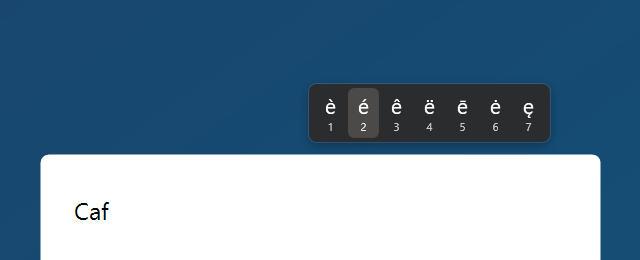

# AccentHold

A macOS-style press-and-hold accent picker for Windows.

Hold a letter, and a small menu of accented variants pops up next to your text
cursor. Pick one with a number key, the arrows, or the mouse. Windows never
shipped this the way macOS does — AccentHold adds it.



## Features

- **macOS mapping** — `a c e i l n o s u y z` and their capitals (e.g. `e` → è é ê ë ē ė ę).
- **Layout-aware** — the letter is resolved from the active keyboard layout, so AZERTY, QWERTY, QWERTZ… all work.
- **Smart placement** — the menu opens above the caret so it never hides what you type, and stays on screen at the edges.
- **Stays out of the way** — it only appears when there is a real text caret, and never steals focus from the app you are typing in.
- **Translucent Windows 11 look** — a clean, rounded, semi-transparent flyout that follows your light/dark theme and accent color.
- **Configurable** — trigger delay, menu size and the accent table itself live in a plain `.ini` file, applied instantly on save.
- **Runs in the background** — a tray icon, optional start-with-Windows, tiny footprint.

## Install

Download the latest `AccentHold-Setup.exe` from
[Releases](https://github.com/AdrienMasanet/AccentHold/releases) and run it.

The installer registers AccentHold in **Installed apps** (so you can remove it
like any program) and offers two options:

- **Start automatically when I sign in** — on by default.
- **Run with administrator privileges** — on by default, so accents also work in
  apps that themselves run elevated. Uncheck it if you prefer a standard process.

Nothing else to do: the app starts immediately and lives in the system tray.

## Usage

1. Hold an accentable letter (e.g. `e`). It types once, then the menu opens.
2. Press the number under the variant you want, or move with `←`/`→` and press `Enter`; `Esc` cancels.
3. Any other key closes the menu and types normally — just like macOS.

## Configuration

Right-click the tray icon → **Settings…** to open `config.ini`
(`%APPDATA%\AccentHold\config.ini`). Changes apply the moment you save.

```ini
[general]
hold_delay_ms = 180   ; delay before the menu appears (50-2000)
scale         = 1.0   ; menu size multiplier (0.7-2.5)

[accents]
; Override or add your own variants; uppercase is derived automatically.
; e = è é ê ë ē ė ę
```

## How it works (and why it's safe)

AccentHold watches for a held key with a standard Windows keyboard hook, purely
to detect the press-and-hold gesture. **It does not record, store, or send
anything.** No file of keystrokes, no network access — the hook lives entirely in
this process and only ever asks "is an accentable key being held?". Everything is
in this repository, MIT-licensed, so you can read exactly what it does. The
optional administrator mode exists only so the accent menu can reach apps that
run elevated; it grants AccentHold no other special behavior.

## Build from source

Requires the [.NET 10 SDK](https://dotnet.microsoft.com/download).

```powershell
dotnet run  --project src\AccentHold                 # run it
dotnet run  --project src\AccentHold -- --demo       # show the menu for a quick visual check
powershell -File scripts\build-installer.ps1         # build the installer (needs Inno Setup 6)
```

## License

[MIT](LICENSE).
